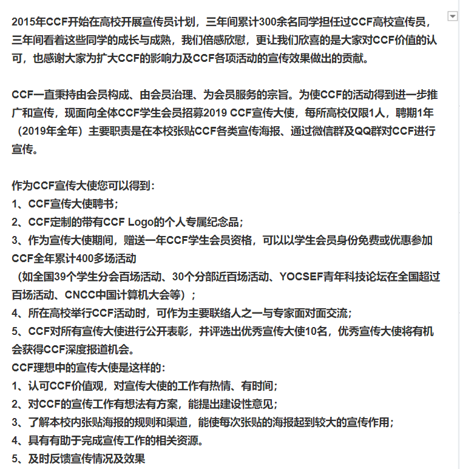
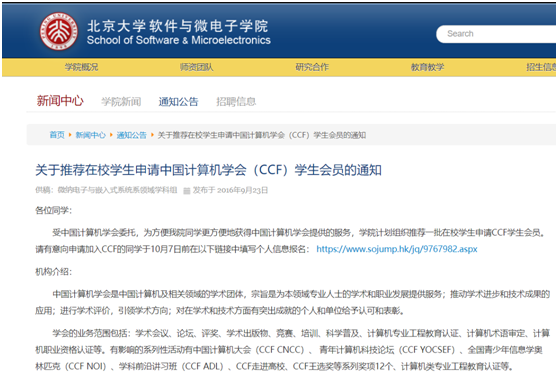

# 一个简单的策划

## 目标

让在校大学生，部分研究生，中学生知道矩阵元，了解并入门Rosetta

我们主要做入门课程，做课程的同时搭给同学们用的学习平台，这样做个两期之后就可以给同学们做认证了。其中给同学们做培训的学习平台很重要，因为Rosetta是在Linux上跑的，搭环境这一步就会难倒很多学生，需要我们去给他们降低门槛，把材料送到他们手上，再让他们去实操。

内容方面实现的预期效果：<http://zh.gluon.ai/index.html>

## 搭建的核心优势

搭建起Rosetta学习平台，平台内置模板程序，更容易上手。准备教学课程和班级，给完成任务的同学进行认证与反馈。只有把技术送到同学手里，同时对参与的同学进行奖励，参与度才会更高。另外，这个平台不仅能给学员用，也会是展示我们技术的一个亮点。

## 解决方案

| 项目                                                | 预算                                                                              | 备注                                              |
| --------------------------------------------------- | --------------------------------------------------------------------------------- | ------------------------------------------------- |
| 利用Jupyter  notebook和虚拟环境搭建在线学习实验平台 | 自建:多个高性能服务器+搭建+运维  服务器基础月费1w/月 参考阿里云，搭建运维费用另计 | 可以快速上手，让学员在5min内体验在线运行Rosetta。 |
| Rosetta 入门网课                                    | 录制第一版，之后进行迭代                                                          |                                                   |
| 课程实验手册                                        | 自制，搭配网课进行迭代                                                            |                                                   |
| 学习交流平台                                        | 低配：使用微信群，知识星球  高配：矩阵元官网内部集成                              | 核心参考对象：星环大数据官网                      |
| 软文宣传                                            | 自制，多参考另外几家即可，强调出我们的创新点和福利                                |                                                   |

## 可参考的其他公司的学生推广活动

- [链接]直播报名 | 百度大脑UNIT平台技术解析与应用探索

<https://mp.weixin.qq.com/s/0Rw1xBUTr0Jpx1Vtt03LXA>
​         

百度做的一期学员大概有1000左右，这个投入主要就是前期推送和课程准备，和矩阵元开发群模式相同，但内容和教学策划高了很多。

- [链接]星环科技大数据架构师认证培训，首次免费线上课程开播啦！

<https://mp.weixin.qq.com/s/xjr6sQNxGVl9puvPW_bfQQ>

 

星环的没有教什么东西，就赚个热度，但是他们有一个公司的认证，而且是限时免费的课程所以让学生们觉得很划算。

- [小程序]欢迎大数据学院的同学申请中国计算机学会（CCF）宣传大使——百度贴吧

<https://tieba.baidu.com/p/5908912064?pid=122366457473&cid=0#122366457473>

 

CCF的活动现在已经不办了，2019是最后一届宣传大使，主要让学生们作为代表在校内做宣传，贴海报和路宣，属于深度发展。

[关于推荐在校学生申请中国计算机学会（CCF）学生会员的通知 - 北京大学软件与微电子学院 (pku.edu.cn)](http://www.ss.pku.edu.cn/index.php/newscenter/notice/2530-关于推荐在校学生申请中国计算机学会ccf学生会员的通知)

 

- [链接]TensorFlow Boost 预启动！“Android + TensorFlow 创新特训”师资培训闭幕

<https://mp.weixin.qq.com/s/KtcQNljW6Ar3Tda_BR_5YA>

 

谷歌的最硬核，但是参与人数最少。
